# HealthLens

A self-hosted dashboard for your Google Takeout health export (Fitbit/Google Health data). You import a Takeout zip once, and HealthLens turns it into workout, sleep, heart, and recovery views with long-term trends and personal records. All data stays on your own server. The UI is built with Material Design 3, so it looks and feels like a native Google app.

> [!NOTE]
> HealthLens is a private, personal project. Claude wrote nearly all of the code from prompts, commonly called "vibe coding." It exists to explore one person's own Takeout export, not as a maintained open-source product — expect rough edges and no support guarantees.

## Features

- **Dashboard** — cross-metric overview with auto-generated insight callouts (new PRs, unusual resting-HR, sleep-debt streaks).
- **Workouts** — personal-record board, pace/HR charts, GPS route maps, per-km splits.
- **Sleep** — nightly hypnogram, sleep-score trends, weekday-vs-weekend comparison.
- **Heart & recovery** — resting heart rate, HRV, stress, SpO2, temperature, readiness, all with medically sourced reference ranges.
- **Shoe tracking** (optional) — assign runs to a shoe, track mileage per pair.
- **Body measurements** (optional) — weight, body fat, and circumference tracking with BMI/WHtR/body-fat assessments.
- **Google Health sync** (optional) — pulls recent activity and weight data from the Google Health API between Takeout exports. Setup steps are in the app under "More."

Every feature beyond the core dashboard is off by default and lives under "More" in the app.

## Screenshots

All screenshots below are from the synthetic [`demo-data`](demo-data/HealthLens-demo-data.zip) dataset (see [First import](#first-import)) — no real personal data, GPS routes included.

**Dashboard** — cross-metric overview, in light and dark mode:

<p>
  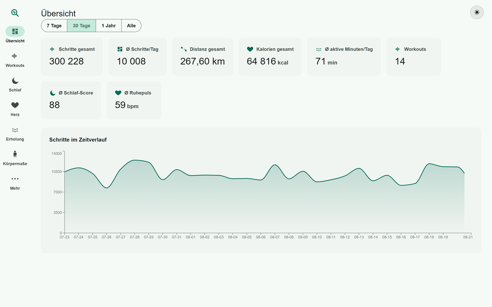
  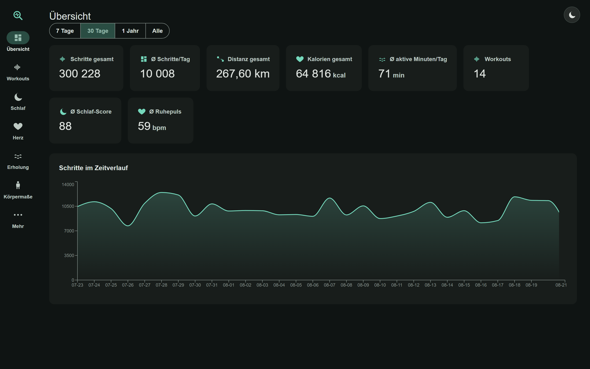
</p>

**Workouts** — personal-record board and searchable/filterable workout list:

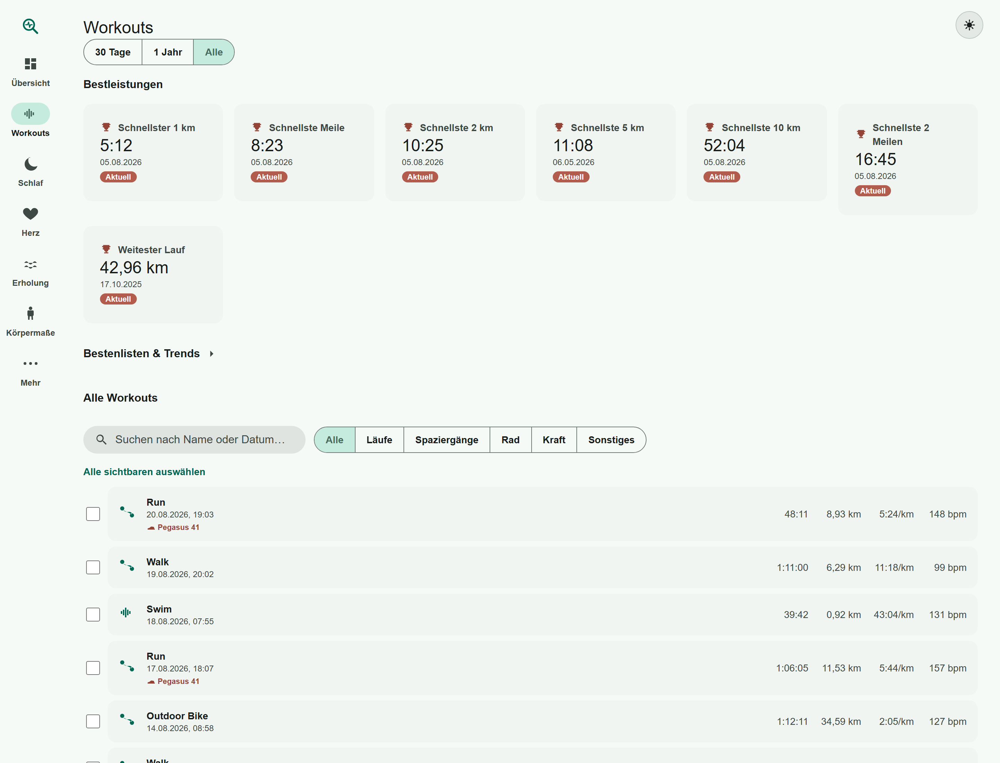

**Workout detail** — KPIs, running-dynamics reference gauges, and a GPS route map (this run is the synthetic New York/Central Park route from the demo data):

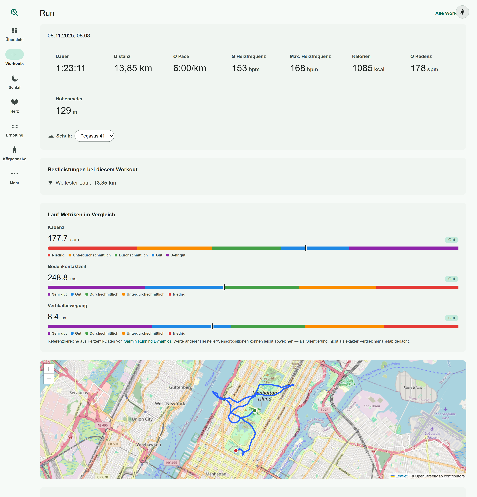

**Sleep** — nightly duration trend and a scrollable history of every night:

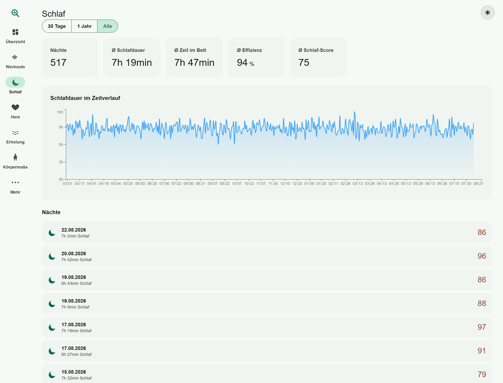

**Heart** — resting heart rate, HRV, Active Zone Minutes, and respiratory rate, each with a medically sourced "what's good/bad" reference gauge:

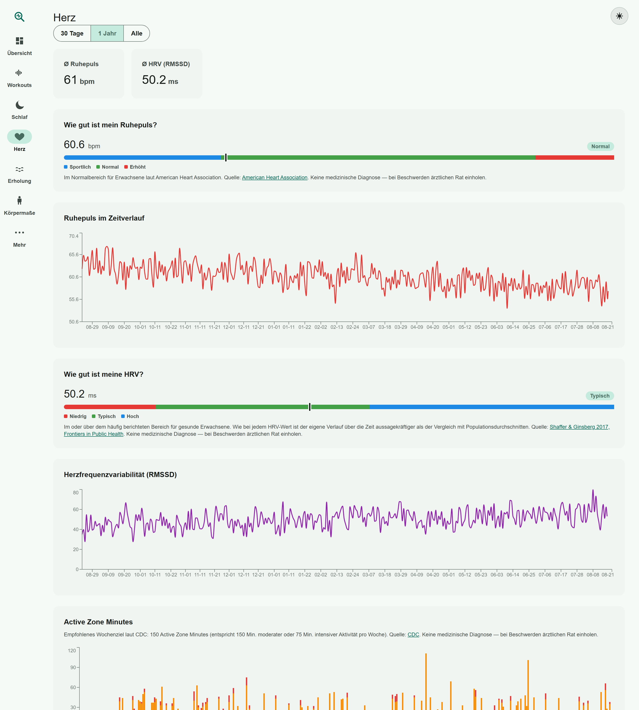

**Recovery** — sleep/resting-HR correlation, stress score, readiness, SpO2, and skin temperature:

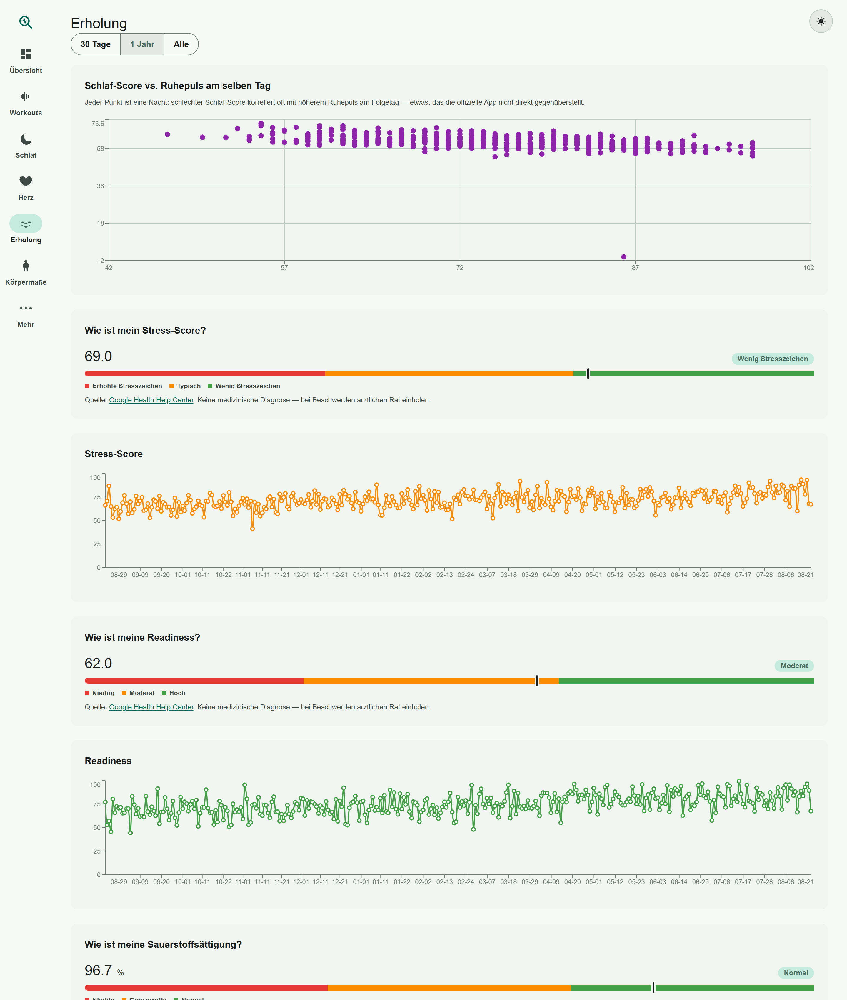

**Body measurements** (optional) — weight/body-fat/waist trends with BMI, waist-to-height ratio, and body-fat-percentage assessments:

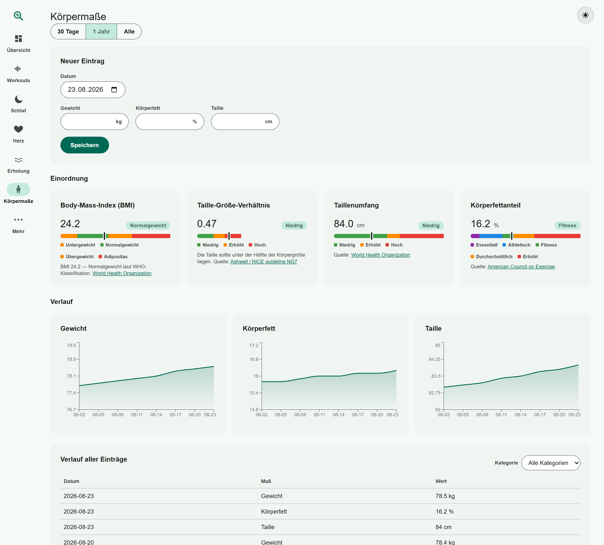

**Shoe tracking** (optional) — mileage per pair, assignable from any workout:

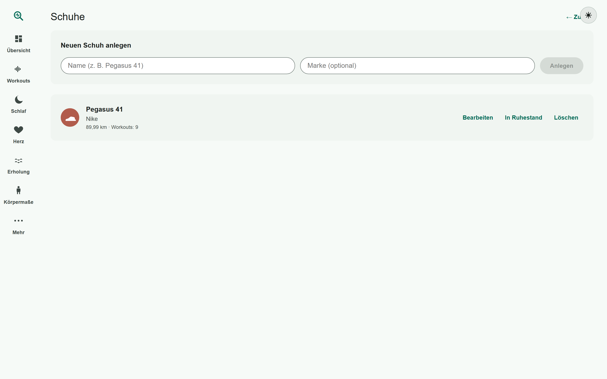

**Settings** — units, language, and 5 Material-3-derived color themes (4 accent colors plus a dedicated near-white/near-black neutral theme):

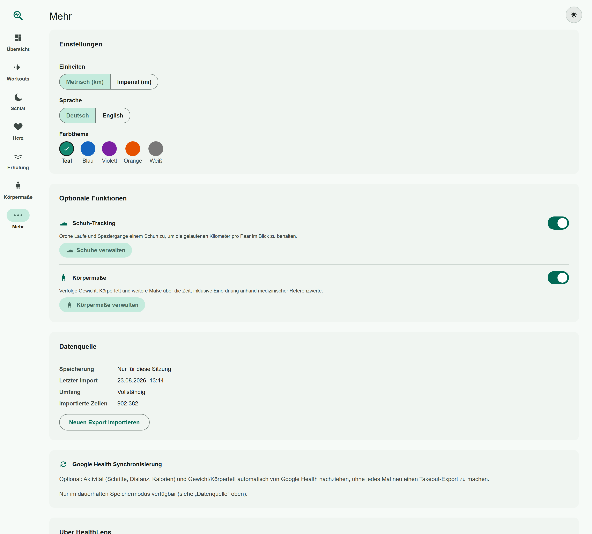

A couple of the color themes applied to the dashboard, for a sense of the range:

<p>
  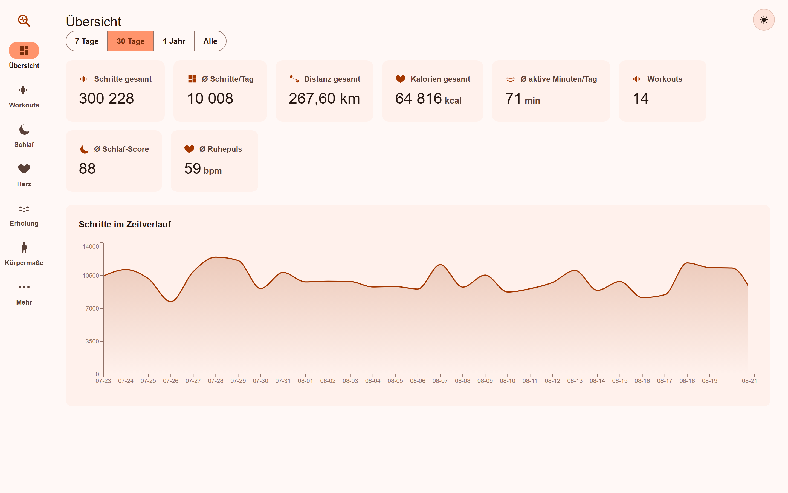
  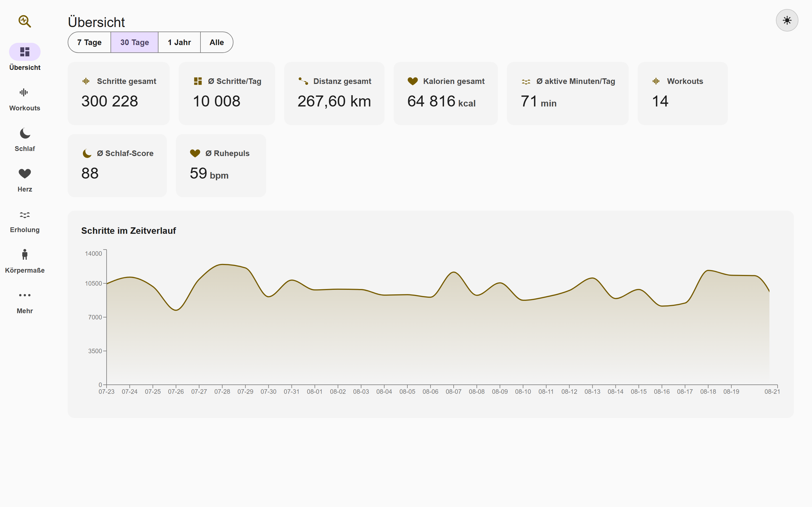
</p>

## Run it with Docker

You need Docker and Docker Compose. From the repository root:

```bash
docker compose up -d
```

This pulls the published image (`ghcr.io/patrickmatula/healthlens`) — no local build, no .NET or Node SDK needed. Open **https://localhost:8443** (recommended) or http://localhost:8080.

> [!TIP]
> The container generates a self-signed certificate on first run for the https port — your browser will show a one-time certificate warning there, which is expected for a local, self-signed certificate; accept it and you're set for future visits from that browser. https is also required for the optional Google Health sync's OAuth redirect, and it encrypts traffic if you ever open HealthLens from another device on your network (e.g. your phone). Prefer zero warnings for local-only use? http://localhost:8080 works identically, just unencrypted.

To build from source instead, edit `docker-compose.yml`: comment out `image:`, uncomment `build: .`, then run `docker compose up -d --build`.

Podman works too — `podman compose up -d` if you have `podman-compose` installed, or run the published image directly:

```bash
podman volume create healthlens-data
podman run -d --name healthlens -p 8080:8080 -p 8443:8443 -v healthlens-data:/app/App_Data ghcr.io/patrickmatula/healthlens:latest
```

Your data lives in a named Docker volume (`healthlens-data`), independent of the container. Removing or rebuilding the container leaves your data intact; `docker compose down -v` deletes it.

To use different host ports, set `HEALTHLENS_PORT` and/or `HEALTHLENS_HTTPS_PORT` before starting:

```bash
HEALTHLENS_PORT=9000 HEALTHLENS_HTTPS_PORT=9443 docker compose up -d
```

To update to the latest published image:

```bash
docker compose pull && docker compose up -d
```

To back up your data:

```bash
docker run --rm -v healthlens-data:/data -v "$PWD":/backup alpine tar czf /backup/healthlens-backup.tar.gz -C /data .
```

## Automated builds

The published image updates itself: dependency and base-image patches are checked weekly, safe updates merge and republish automatically, and every code change gets its own version tag (e.g. `v1.4.2`) alongside `latest`. Pin `docker-compose.yml` to a specific tag if you'd rather update on your own schedule. Details for maintainers are in the `.github/workflows/` files.

## First import

Export your data from [Google Takeout](https://takeout.google.com) under "Google Health," unzip it, and upload the zip on HealthLens' first screen. Choose "Curated" for a fast import with 1-minute aggregates outside workouts, or "Full" to keep every raw data point. Both keep full resolution during workouts.

You can also import without saving anything to disk ("session only") to try the app on a one-off export.

Don't have a Takeout export handy? [`demo-data/HealthLens-demo-data.zip`](demo-data/HealthLens-demo-data.zip) is a synthetic 18-month dataset covering every feature (workouts with GPS routes in New York, Sydney, and Hong Kong, sleep, heart, recovery) — import it with "session only" to explore the app risk-free.

## Local development

Requires .NET 10 SDK and Node 20.19+ (or 22.12+).

```bash
dotnet run --project backend/HealthLens.Api    # API on :5172
npm --prefix frontend run dev                  # Vite dev server, proxies /api to :5172
```

## Privacy

HealthLens sends nothing anywhere except what you explicitly connect: your own server stores your imported data, and the optional Google Health sync talks directly to Google's API using OAuth credentials you register yourself.

## Security

> [!WARNING]
> HealthLens has **no login of any kind** — anyone who can reach the app over the network can see your health data (including GPS routes) and manage the Google Health connection. This is a deliberate choice for a single-user, self-hosted tool, not an oversight, but it means **you're responsible for the network boundary**: only run this on a network you trust (e.g. behind your home router, with no port forwarding), never expose it directly to the internet, and don't put it on a shared/public Wi-Fi without a firewall in front of it. `docker compose up -d` binds both ports to all network interfaces by default — restrict `docker-compose.yml`'s `ports:` to `127.0.0.1:8080:8080`/`127.0.0.1:8443:8443` if you want it reachable only from the machine it runs on.

Within that trust model, sensitive data at rest is still protected: the Google OAuth tokens and your OAuth client secret are encrypted on disk (ASP.NET Core Data Protection, keyed from `App_Data/keys`), Takeout zip imports are checked against zip-bomb-style decompression before extraction, and state-changing requests require a header a plain cross-site form submission can't set, as a baseline defense against a malicious page on your network blindly triggering an import or reconfiguring the Google Health connection.

## License

[CC BY-NC 4.0](https://creativecommons.org/licenses/by-nc/4.0/) — see [LICENSE](LICENSE). Use, modify, and share this for any non-commercial purpose, as long as you credit this repository. No commercial use.
